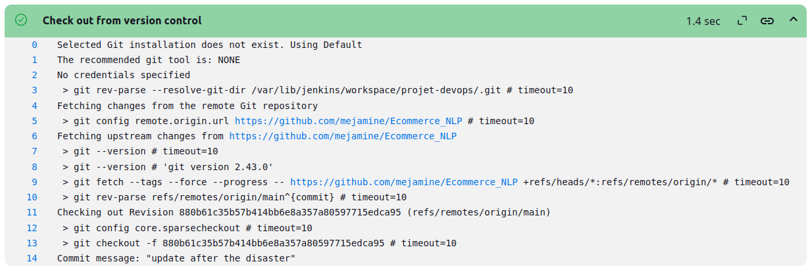

Welcome to our documentation for this project 

# Application : 

this is a project based on 3 parts :

    api : Node Backend Application -> connected to a MongoDb Atlas cluster 
    python : Backend Flask Application that contains an nlp model using spaCy
    client : React Vite Frontend Application

to run this project all you need to do is the next :

    1. in ./api :

        npm install
        npm start

    2. in ./cliont :

        npm install 
        npm run dev

    3. in ./python :

        -> to run the flask application you need to have python installed locally 
        -> then install with pip the dependencies written in requirements.txt
        python NLP_Backend.py

    => by this you'll have the application working locally on the following ports : 

        api : 4000
        python : 5000
        client : 5173
    
    => to see the app just open your browser and open http://localhost:5173 you'll find the app  working

# DevOps : 

So the goal from the next step is to build a CI/CD pipline for the previous project we talked about

    + Docker :

        1. as a first step we created for every part of the project a Dockerfile in the route of the service :

            api Dockerfile -> ./api
            client Dockerfile -> ./client
            python Dockerfile -> ./python
        
        2. the next step is to create a Docker compose file (compose.yml) in the route of the project :

            app
            |__api
            |__client
            |__python
            |__compose.yml

            this file contains all the information docker needs to create images and run containers of our app :

                . Dockerfile location for every service
                . ports
                . envirment variables for every service 
                . command lines to run the service

        3. to check if our work has no errors , the images are good and the containers runs perfectly and connect between each other we need to run the following command line :

            docker compose -f compose.yml up --build
            -> this command line will build the three images we need , create three containers and run them in the same network that it created

            if you're using docker desktop you'll find something like this :

<image><image><image><image><image><image><image><image><image><image>

    all the next steps are on ubuntu 24

    + Jenkins (CI) :

        this step has a global goal to build all three images of the app and push them into dockerhub every time you push a modification into github repository

        for now in developer mode i'm not gonna set a triger and i'm gonna buil the pipline manually 

        1. the first step is to install jenkins locally or in a virtual machine :

            you need first to have in my case (ubuntu 24) java 17 so if you don't have it locally you need to install it 
            then you need to install jenkins from the documentation in jenkins official website
            then you start it with the followin :

                sudo systemctl start jenkins

            to ckeck jenkins type :

                sudo systemctl status jenkins 

            then you open your browser and open the following link : 

                localhost:8080 and follow the constructions to continue the installation of jenkins till you find your self in this interface : 
            
<image><image><image><image><image><image><image><image><image><image><image>

        2. a trick you need to do so you can give access jenkins to docker on your local terminal is to modify the sudoers with the following command line : 

            sudo visudo

            then add the following in the end of the file :

                jenkins ALL=(ALL) NOPASSWD: /usr/bin/docker

            restart jenkins with : sudo systemctl restart jenkins

            and you're good to go 

        3. the next step is to create a Jenkinsfile (where we wrote our pipline) in the same spot where the compose.yml exists :

            app
            |__api
            |__client
            |__python
            |__compose.yml
            |__Jenkinsfile

        4.  create an item in jenkins interface with a pipline type where you configure it as csm and put the github repo url (main as branch)

        5. the final step is to build the pipline : 
             
            here's what we should find : 

by this we finish th CI part of our pipline 

the next step is CD part : 

    + Minikube & kubectl :

        1. install minikube and kubectl 

        2. start minikube with docker driver : 

            minikube start --driver=docker

        3. run the following command line to check minikube and the cluster

            kubectl cluster info

            kubectl config view

            kubectl get pods

            kubectl get nodes 

    + K8s simple : 

        1. so i created a k8s folder where i'm gonna put the kubernetes manifests : 

            k8s
            |__app-configmap.yaml
            |__api-deployment.yaml
            |__api-service.yaml
            |__client-deployment.yaml
            |__client-service.yaml
            |__pythonnlp-deployment.yaml
            |__pythonnlp-service.yaml

        2. the next step is to apply these manifests to our minikube cluster with the following command line : 

            kubectl apply -f <file_name.yaml>

        3. then we just wait for the cluster to pull the images from dockerhub, create the containers and run them on the same network

        we can just from time to time check with the following command line : 

            kubectl get pods

            we should find this (we can access our app from the cluster)

        4. to access the app all we need to do is run the following command line to get the url of the frontend app (client) wich is related to the other containers : 

            minikube service client-service --url 

    + helm + ArgoCD :

